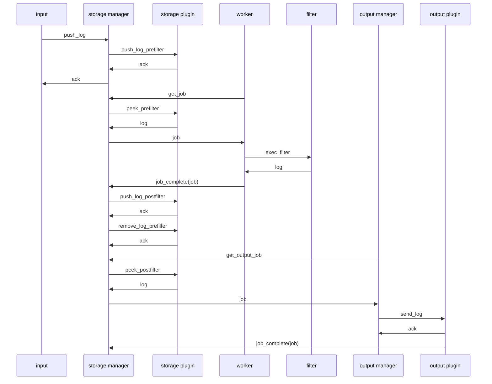

```mermaid
sequenceDiagram
    participant i as input
    participant sm as storage manager
    participant sp as storage plugin
    participant w as worker
    participant f as filter
    participant om as output manager
    participant op as output plugin

    i->>sm: push_log
    sm->>sp: push_log_prefilter
    sp->>sm: ack
    sm->>i: ack

    w->>sm: get_job
    sm->>sp: peek_prefilter
    sp->>sm: log

    sm->>w: job
    w->>f: exec_filter
    f->>w: log

    w->>sm: job_complete(job)
    sm->>sp: push_log_postfilter
    sp->>sm: ack

    sm->>sp: remove_log_prefilter
    sp->>sm: ack

    om->>sm: get_output_job
    sm->>sp: peek_postfilter
    sp->>sm: log
    sm->>om: job

    om->>op: send_log
    op->>om: ack
    op->>sm: job_complete(job)
```